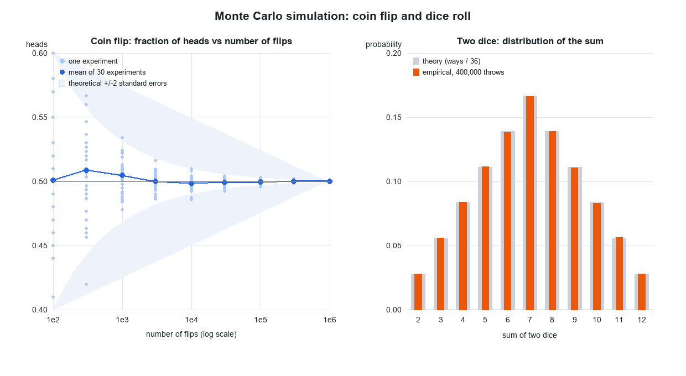

# Monte Carlo: бросок монеты и игральной кости

Учебный проект по методу Монте-Карло: компьютерная симуляция случайных экспериментов
и проверка того, насколько эмпирические результаты сходятся с теорией вероятностей.



## Что показывает проект

| № | Эксперимент | Проверяемая идея |
|---|---|---|
| 1 | Бросок монеты | Закон больших чисел, стандартная ошибка `1/(2*sqrt(n))` |
| 2 | Бросок одной кости, 600 000 раз | Равномерное распределение, критерий хи-квадрат |
| 3 | Бросок двух костей, 400 000 раз | Распределение суммы, треугольная форма |
| 4 | Сходящееся среднее | Математическое ожидание `E[X] = 3.5` |
| 5 | Игра с отрицательным EV | Почему казино выигрывает на длинной дистанции |

## Ключевые результаты

**Монета — чем больше бросков, тем ближе к 0.5:**

| n (бросков) | частота орла | ошибка | 2·SE |
|---|---|---|---|
| 10 | 0.40000 | 0.10000 | 0.316 |
| 1 000 | 0.50000 | 0.00000 | 0.032 |
| 1 000 000 | 0.50061 | 0.00061 | 0.001 |

**Одна кость:** статистика хи-квадрат = 6.19 при критическом значении 11.07 (df = 5, 95%)
— отклонение случайно, кость честная. Среднее 600 000 бросков: 3.50378 против теории 3.5.

**Две кости:** сумма `s` выпадает `6 - |s - 7|` способами из 36, поэтому максимум приходится
на 7 (16.67%). Эмпирика совпала с теорией до третьего знака.

**Игра со ставкой $1:** угадал грань → `+$4`, не угадал → `-$1`.
Теоретическое ожидание `4*(1/6) - 1*(5/6) = -0.1667 $` за ставку.
За 100 000 ставок симуляция дала `-0.16635 $` на ставку — то есть проигрыш,
предсказанный формулой, а не «неудачей».

## Запуск

```bash
pip install -r requirements.txt
python monte_carlo.py
```

Скрипт выводит таблицы в консоль и сохраняет график `coin_dice_monte_carlo.png`.

Требуется Python 3.10+ (используется синтаксис `X | None` в аннотациях типов).

## Как менять условия эксперимента

```python
flip_coins(n, p=0.5)     # p=0.6 — несимметричная монета
roll_dice(n, sides=6)    # sides=20 — двадцатигранник
```

Генератор случайных чисел инициализирован фиксированным seed (`RNG_SEED = 42`),
поэтому результаты воспроизводимы: у любого, кто запустит скрипт, получатся те же числа.
Измените seed — числа слегка «поплывут», а статистические выводы останутся теми же.

## Что можно добавить дальше

- Оценка числа π методом Монте-Карло (точки в квадрате и круге).
- Парадокс дней рождения и парадокс Монти Холла.
- Сумма трёх и более костей — выход на нормальное распределение (ЦПТ).
- Проверка гипотез: t-тест, доверительные интервалы.
- Геометрическое броуновское движение как модель цены — шаг к финансовой математике.

## Лицензия

MIT — см. [LICENSE](LICENSE).
